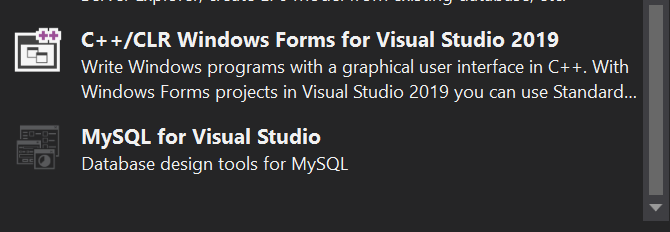
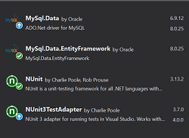
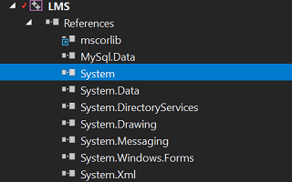
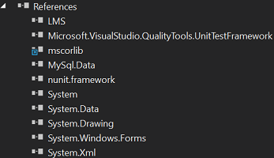
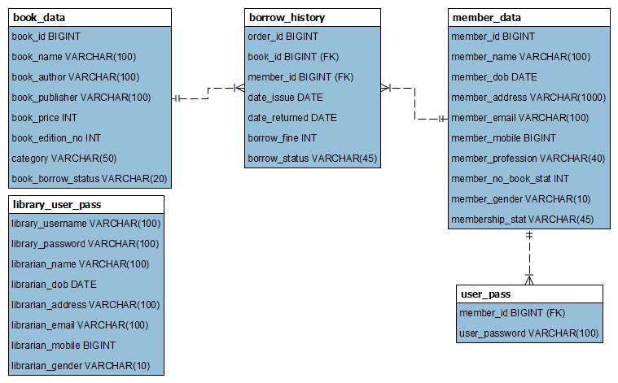
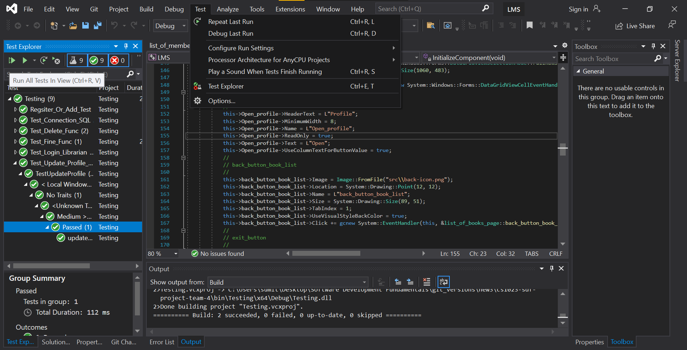

# Library Management System

## Our Design Principle
- Our methodology consists of being _Feature-Driven_ and also making an _interactive_ application to the end user. But with every new feature there also comes the responsibility that no new feature should break any other feature or tamper with the database
- So if any new feature that you are trying to add tries to add, modify, or remove data from the database then it is preferable to not directly use the main database upon which the entire application links with instead create some other test database and test all your functions on that
- If you are adding a new form then do everything step by step and not rush into adding everything in the form at once

| Table of contents |
|------------------|
|[File System](#File-System)|
|[Prerequisites and Installations](#Prerequisites-and-Installations) |
|[Writing Code](#Writing-Code)|
|[Database Description](#Database-Description)|
|[Adding New Form](Adding-New-Form)|
|[Adding New Element](Adding-New-Element)|
|[Adding Functions or Methods](Adding-Functions-or-Methods)|
|[Testing Framework](Testing-Framework)|

## File System
- According to File System for the Main Project i.e. **LMS**, the source code for every Form/Page, its _.h_ _.cpp_ files are saved in the _**src**_ folder
- Specific to each button and form loading there is a specific function that should be in a separate _.h_ _.cpp_ file or some group of those similar functions should be in a separate _.h_ _.cpp_ file inside _**written_functions**_ folder
- The entire application is based on the Event-Driven Application approach, i.e. the application will do something only on Click-Events such as Button Clicks
- For **Testing**, a separate Project has been created in the solution directory by the name **Testing** and in that all the _.h_ _.cpp_ files must be in one folder and all the tests should be written in _Testing.cpp_ or you may add more files for the same

## Prerequisites and Installations
1. It is important to be familiar with using Visual Studio as an Integrated Development Environment and install the following packages from Visual Studio Installer

	</img> </img>
	</img> </img>
	</img>

2. _Clone_ the GitHub Repository in a folder and open the **.sln** file i.e. **LMS.sln** (present at top level directory)
3. Go to Extensions and Install the following extensions that would be needed to perform certain tasks


4. Make sure that all the NuGet Packages are also installed for the project and added into references for the project

	
	
	

5. Install MySQL Community Version from the official website [MySQL installer for Windows](https://dev.mysql.com/downloads/windows/installer/). <br>

	### Installation
	- Download installer from above link and run the installer.
	- Accept the license agreement.
	- Choose **Developer Default** setup type and click next.
	- Click **Execute** to install MySQL products.
	- Click **Next** for _Product Configuration_ settings.

		</img>
		</img>

	### Configuration
	- In _Type and Networking_, choose **Standalone MySQL Server/Classic MySQL Replication** and click **Next**.
	- Leave it as default in _Server Configuration Type_ settings.
	- Set a _Root Account Password_.
	- Add a user with Database role as _DB Admin_ and click **Next**.
	- Leave it as default in _Windows Service_ and _Plugins and Extensions_ settings.
	- Now click **Execute** to _Apply Server Configuration_.

		</img>
		</img>
	- For _Router Confiugration_, leave it as default and click next.
	- For configuring _Samples and Examples_, choose server and check connection with **Check** Button.
	- Click **Next** and **Execute** to finish confiugration settings.

		</img>
		</img>
- > **_NOTE:_**  Follow [How To Install MySQL on Windows 10 ](https://youtu.be/WuBcTJnIuzo?t=259) for detailed tutorial on installation and configuration.
## Writing Code
- The entire application is written in C++ and Windows Forms Application Libraries or else known as Microsoft .NET libraries
- The advantages of the libraries being used is that it was developed by Microsoft to enhance C++ to work with Windows API and GUI Framework
- But developers may call ISO C++ Library for functions/methods which are independent of the application or for any other general purpose
- This form of C++ is officially known as C++/CLI according to ECMA
- There are a few small differences from ISO C++ which the .NET libraries use, i.e. 

```cpp
System // this namespace provides access to the libraries for GUI framework and other data types used by the framework

gcnew // this is an overloaded version of new which has access to garbage collector provided by framework

public ref class // It's a class whose object lifetime is administered automatically and supports the Windows Runtime type system.

^ operator // It is called handle declarator. It behaves like a pointer to the object which points to the entire object. It is provided by the framework
```

## Database Description
- There is 1 schema:  
```sql
library_system_db
```

- There 5 tables inside this schema:
```sql
member_data		# This stores all details associated with Members
user_pass		# This stores the UserName and Passwords (Hashed) of All the Members
book_data		# This stores all details associated with Books
borrow_history		# This stores all details associated with Borrowing of Books
library_user_pass	# This stores all details of Librarians as well as their UserName and Password (Hashed)
```

Here is Entity Relationship Diagram of the Schema
> **_NOTE:_**  Object Notation is Classic and Relationship Notation is Crow's Foot (IE)


## Adding New Form
1. To _add a new Form_, _right-click_ on the **project**
2. Click on _Add_ → **New Item**
3. Choose _Windows Form_ from UI
4. Give Appropriate Name which signifies its function or purpose
5. Save the Form in _**src**_ folder

## Adding Functions or Methods

To add a function or a method, it is preferable to add the function in a new _**.h .cpp**_ file inside the folder **written functions**
1. _Right-Click_ on the **Project**
2. Click on _Add_ → **New Item**
3. Choose Header File (_.h_) and name it appropriately and save it in the folder **written functions**
4. Repeat the same for Adding Source File (_.cpp_)

If you are adding a method similar to the one which has already been written inside a specific file then add your method to that file as well.

> :warning: DO NOT forget to include the header file which contains the function in which it is being called

## Testing Framework
In order to use the test framework, make sure that the required references and NuGet Packages are installed and added

1. _Copy Paste_ all the files that need to be tested inside a separate folder in **Testing** (in solution directory)
2. _Right Click_ on **Testing_ Project** and then Click _Add_ → **Existing Item**
3. Choose the required files and click on add
4. Include the files in the _.cpp_ file where all the tests are being written
5. Write the test in this particular format so that the Test Framework can recognize the Test Class

	```cpp
	using namespace System;
	using namespace System::ComponentModel;
	using namespace System::Collections;
	using namespace System::Windows::Forms;
	using namespace System::Data;
	using namespace System::Drawing;
	using namespace MySql::Data::MySqlClient;
	using namespace NUnit::Framework;
	using namespace Microsoft::VisualStudio::TestTools::UnitTesting;
	using namespace Microsoft::VisualStudio::TestTools;

	namespace TestLibrary 
	{
		[TestFixture]
		public ref class TestClass1
		{
		public:
			[Test]
			void methodclass() 
			{
				// write expected variables

				//write actual variables which calls the function to be tested

				NUnit::Framework::Assert::AreEqual(expected, actual);

			}
		};
	}
	```

6. From the menu select **Test** and **Run All tests**


The Reasons for doing this Procedure:
- Before adding the function to the application, it is preferable to Test the function with certain inputs and check if it is giving the desired output.

- This not only saves the application from throwing build errors, but also helps Test for any situations that may arise to give invalid output
